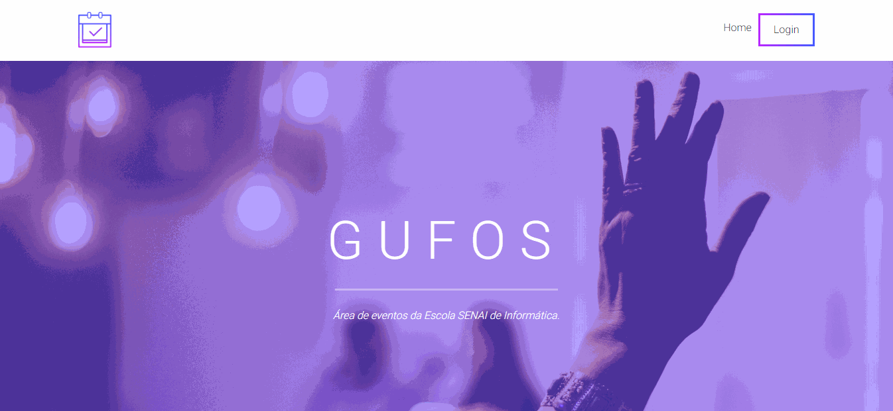

# Gufos - SENAI

## Projeto WEB desenvolvido na Escola SENAI de Informática

### Tecnologias utilizadas:

- HTML

- CSS

- [React](https://github.com/facebook/react)

- [Material Design Bootstrap](https://mdbootstrap.com/docs/react/)

- [Axios](https://github.com/axios/axios)

- .NET Core

- SQL Server

- Swagger

- Entity Framework Core
